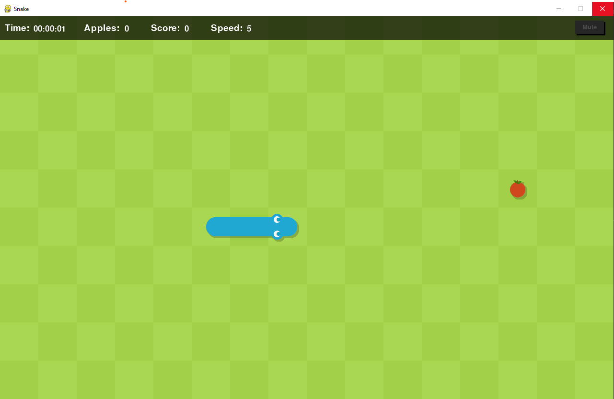
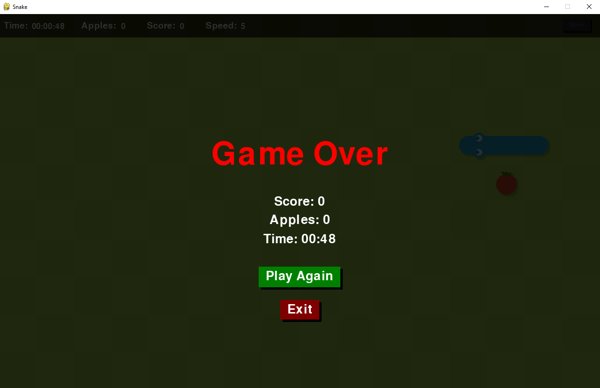

# Snake Game

This project is a Python-based implementation of the classic Snake game, utilizing the Pygame library for its graphical interface and game dynamics.

## Screenshots

## Technologies Used:

- Python
- Pygame
- Object-Oriented Programming (OOP)

## Features:

- Dynamic snake movement with responsive controls.
- Two types of apples: normal and special, with varying scores.
- Real-time game status bar showing score, number of apples eaten, and game duration.
- Adjustable snake speed for varied gameplay difficulty.
- Sound effects and background music with a mute/unmute feature.
- A game-over screen with options to replay or exit.
- Includes keyboard controllers
    - Arrow Keys: Move the snake in the respective direction.
    - M Key: Mute or unmute the game sounds.

## How to use

- Clone the project
- Install Python (v3.11.5)
- Run `pip install pygame` to current directory
- Run `cd code` change to the code directory

## Run app

In the project directory, you can run:

`python main.py`
